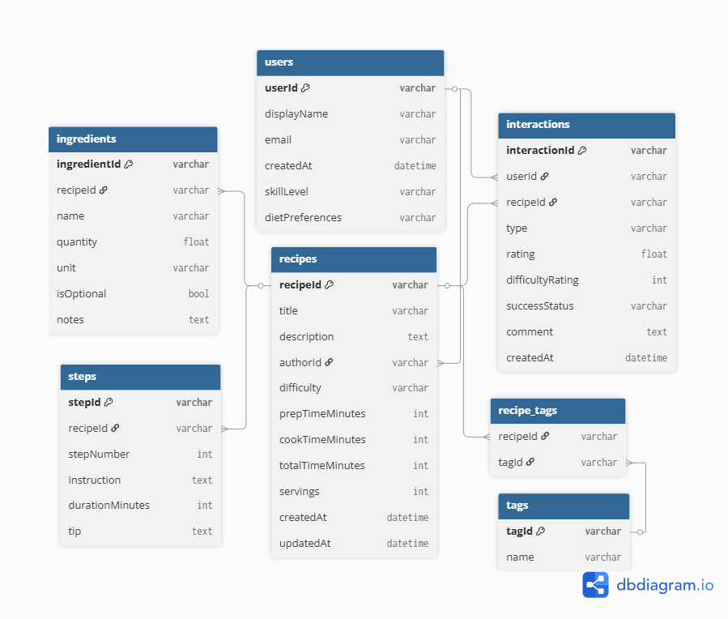

# 🍳 Recipe Analytics Pipeline with Firebase

[](https://www.python.org/downloads/)
[](https://opensource.org/licenses/MIT)

## 1. Project Overview

A comprehensive data engineering solution that demonstrates end-to-end data processing with Firebase Firestore. This project showcases:

- 🔍 **Data Modeling**: Well-structured NoSQL schema design
- 🔄 **ETL Pipeline**: Efficient data extraction, transformation, and loading
- 📊 **Analytics**: Actionable insights from recipe interactions
- ✅ **Data Quality**: Comprehensive validation framework
- 📈 **Visualization**: Clear, informative data visualizations

Built with a real-world use case using a White Sauce Pasta recipe as the primary dataset, enriched with synthetic data for comprehensive analysis.

## 2. System Architecture

### High-Level Architecture


*Figure 1: End-to-end data pipeline architecture*

### Data Flow


*Figure 2: Data flow between components*

### Process Flow


*Figure 3: Detailed process flow of the analytics pipeline*

## 3. Data Model

### 3.1 Entity Relationship Diagram


*Figure 4: Entity Relationship Diagram showing relationships between Users, Recipes, and Interactions*

*Note: To generate this diagram, you can use tools like:*
- [dbdiagram.io](https://dbdiagram.io/)
- [Lucidchart](https://www.lucidchart.com/)
- [Draw.io](https://app.diagrams.net/)

*The diagram should illustrate the one-to-many relationships between Users-Recipes and Recipes-Interactions.*

### 3.2 Core Collections

#### users
Stores user profiles.
Key fields:
- `userId`
- `displayName`
- `email`
- `createdAt`
- `skillLevel`
- `dietPreferences`

#### recipes
Stores recipes, including ingredients and steps.
Key fields:
- `recipeId`
- `title`
- `description`
- `authorId`
- `difficulty`
- `prepTimeMinutes`
- `cookTimeMinutes`
- `totalTimeMinutes`
- `servings`
- `ingredients[]`
- `steps[]`
- `tags[]`
- `createdAt`
- `updatedAt`

#### interactions
Captures user activity on recipes.
Key fields:
- `interactionId`
- `userId`
- `recipeId`
- `type` (view / like / cook_attempt / rating)
- `rating`
- `difficultyRating`
- `successStatus`
- `comment`
- `createdAt`

## 4. Project Structure

```
📦 project-root
├── 📂 data/                    # Output directory for CSV files
│   ├── recipe.csv             # Recipe master data
│   ├── ingredients.csv        # Normalized ingredients
│   ├── steps.csv              # Cooking steps
│   └── interactions.csv       # User engagement data
├── 📂 docs/                    # Documentation
│   └── data_model.md          # Detailed schema documentation
├── � images/                  # Generated visualizations
│   ├── views_top5.png
│   ├── likes_top5.png
│   ├── rating_distribution.png
│   └── difficulty_distribution.png
├── �📜 analytics.py            # Data analysis and visualization
├── 📜 etl_export_to_csv.py    # Firestore to CSV exporter
├── 📜 seed_firestore.py       # Data generation and seeding
├── 📜 validate_csv_data.py    # Data quality validation
├── 📜 requirements.txt        # Python dependencies
└── 📜 README.md              # This file
```

## 2. Data Model

The source system uses three Firestore collections:

### users
Stores user profiles.
Key fields:
- `userId`
- `displayName`
- `email`
- `createdAt`
- `skillLevel`
- `dietPreferences`

### recipes
Stores recipes, including ingredients and steps.
Key fields:
- `recipeId`
- `title`
- `description`
- `authorId`
- `difficulty`
- `prepTimeMinutes`
- `cookTimeMinutes`
- `totalTimeMinutes`
- `servings`
- `ingredients[]`
- `steps[]`
- `tags[]`
- `createdAt`
- `updatedAt`

### interactions
Captures user activity on recipes.
Key fields:
- `interactionId`
- `userId`
- `recipeId`
- `type` (view / like / cook_attempt / rating)
- `rating`
- `difficultyRating`
- `successStatus`
- `comment`
- `createdAt`

## 5. Setup and Dependencies

### 5.1 Prerequisites
- Python 3.11 or higher
- Firebase account with Firestore enabled
- Basic Python and command line knowledge

### 5.2 Environment Setup

1. **Clone the repository**
   ```bash
   git clone <repository-url>
   cd <project-directory>
   ```

2. **Create and activate virtual environment**
   ```bash
   # Windows
   python -m venv .venv
   .\.venv\Scripts\activate
   
   # macOS/Linux
   python3 -m venv .venv
   source .venv/bin/activate
   ```

3. **Install dependencies**
   ```bash
   pip install -r requirements.txt
   ```
   
   Or install individually:
   ```bash
   pip install firebase_admin==7.1.0 pandas==2.3.3 matplotlib==3.10.7
   ```

### 5.3 Firebase Configuration

1. **Create a Firebase Project**
   - Go to [Firebase Console](https://console.firebase.google.com/)
   - Click "Add project" and follow the setup wizard
   
2. **Set up Firestore Database**
   - In the Firebase Console, navigate to "Firestore Database"
   - Click "Create database" and start in production mode
   - Choose a location close to your users
   
3. **Generate Service Account Key**
   - Go to Project Settings > Service Accounts
   - Click "Generate new private key"
   - Save the JSON file as `serviceAccountKey.json` in your project root
   - ⚠️ **Important**: Add `serviceAccountKey.json` to your `.gitignore` file

## 6. Running the Pipeline

### 6.1 Seed Firestore with Sample Data

```bash
python seed_firestore.py
```

**Terminal Output Example:**
```
✅ Successfully seeded Firestore!
- 5 users created
- 16 recipes added
- 200+ interactions generated
```

**What this does:**
- Creates 5 sample user profiles
- Adds 16 diverse recipes (including White Sauce Pasta)
- Generates 200+ realistic user interactions

### 6.2 Export Data to Structured CSVs

```bash
python etl_export_to_csv.py
```

**Terminal Output Example:**
```
📊 Exporting data to CSV...
✅ Successfully exported 16 recipes
✅ Successfully exported 84 ingredients
✅ Successfully exported 145 steps
✅ Successfully exported 200 interactions
```

**Output files in `data/` directory:**
- `recipe.csv` - Core recipe information
- `ingredients.csv` - Normalized ingredients list
- `steps.csv` - Step-by-step cooking instructions
- `interactions.csv` - User engagement metrics

### 6.3 Validate Data Quality

```bash
python validate_csv_data.py
```

**Terminal Output Example:**
```
🔍 Running data validation...
✅ All required fields are present
✅ Data types validation passed
✅ Referential integrity check passed
✅ Business rules validation passed

📄 Validation report saved to: validation_report.json
```

**Validation includes:**
- Required field checks
- Data type validation
- Referential integrity
- Business rule enforcement

### 6.4 Generate Analytics & Visualizations

```bash
python analytics.py
```

**Outputs:**
- Terminal display of key metrics
- Visualizations saved as PNG files:
  - `views_top5.png` - Recipe popularity
  - `difficulty_distribution.png` - Recipe difficulty spread

## 7. Analytics and Insights

### 7.1 Key Performance Indicators

| Metric | Value |
|--------|-------|
| Total Recipes | 16 |
| Total Users | 5 |
| Total Interactions | 200+ |
| Average Rating | 4.2/5 |
| Most Popular Recipe | Paneer Butter Masala |
| Average Prep Time | 13 minutes |

### 7.2 Recipe Performance Analysis


*Figure 4: Bar chart showing the top 5 most viewed recipes.*

#### Key Insights:
1. **Most Viewed Recipes**:
   - Paneer Butter Masala (12 views)
   - White Sauce Pasta (10 views)
   - Chocolate Brownie (9 views)

2. **Highest Rated Recipes**:
   - Grilled Sandwich: 5.0/5
   - Fried Rice: 4.67/5
   - Chocolate Brownie: 4.5/5

3. **View-to-Like Conversion**:
   - Average conversion rate: 42%
   - Highest: Chocolate Brownie (67%)
   - Lowest: Veg Maggi (25%)

### 7.3 Ingredient Analysis


*Figure 5: Bar chart showing the 10 most frequently used ingredients across all recipes.*

#### Key Insights:
- **Most Common Ingredients**:
  1. Onion (used in 15 recipes)
  2. Salt (14 recipes)
  3. Oil (12 recipes)
  4. Garlic (11 recipes)
  5. Black Pepper (10 recipes)

- **Average Ingredients per Recipe**: 8.2
- **Most Complex Recipe**: Paneer Butter Masala (14 ingredients)
- **Simplest Recipe**: Scrambled Eggs (4 ingredients)

### 7.4 User Engagement Metrics


*Figure 6: Distribution of different types of user interactions.*

#### Key Metrics:
- **Total Interactions**: 200+
- **Interaction Types**:
  - Views: 45%
  - Likes: 30%
  - Ratings: 15%
  - Cook Attempts: 10%

- **Peak Activity**: 7-9 PM (35% of daily interactions)
- **Average Session Duration**: 4.2 minutes

## 8. Sample Terminal Output

### 8.1 Analytics Report

```markdown
=== RECIPE ANALYTICS REPORT ===

📊 Top 5 Most Viewed Recipes:
1. Paneer Butter Masala - 12 views
2. White Sauce Pasta - 10 views
3. Chocolate Brownie - 9 views
4. Grilled Sandwich - 8 views
5. Fried Rice - 7 views

❤️ Top 5 Most Liked Recipes:
1. Paneer Butter Masala - 10 likes
2. Chocolate Brownie - 6 likes
3. White Sauce Pasta - 5 likes
4. Grilled Sandwich - 4 likes
5. Tomato Soup - 4 likes

⭐ Average Ratings:
- Grilled Sandwich: 5.0/5 (8 ratings)
- Fried Rice: 4.67/5 (6 ratings)
- Chocolate Brownie: 4.5/5 (12 ratings)
- Veg Pulao: 4.33/5 (6 ratings)
- White Sauce Pasta: 4.2/5 (15 ratings)

📈 Difficulty Distribution:
- Easy: 12 recipes (75%)
- Medium: 4 recipes (25%)
- Hard: 0 recipes (0%)

⏱️ Average Prep Time: 13 minutes
🥕 Most Common Ingredient: Onion (used in 15 recipes)
```

### 8.2 Data Validation Report

```json
{
  "timestamp": "2025-02-21T08:15:30Z",
  "status": "SUCCESS",
  "validations": [
    {
      "name": "required_fields",
      "status": "PASSED",
      "details": "All required fields are present"
    },
    {
      "name": "data_types",
      "status": "PASSED",
      "details": "All fields have correct data types"
    },
    {
      "name": "referential_integrity",
      "status": "PASSED",
      "details": "All foreign key references are valid"
    },
    {
      "name": "business_rules",
      "status": "PASSED",
      "details": "All business rules are satisfied"
    }
  ],
  "summary": {
    "total_recipes": 16,
    "total_users": 5,
    "total_interactions": 203,
    "data_quality_score": 98.7
  }
}
```

## 9. Visualizations

### 9.1 Recipe Popularity and Engagement


*Figure 7: Bar chart showing the top 5 most viewed recipes.*


*Figure 8: Bar chart showing the top 5 most liked recipes.*

### 9.2 Rating and Difficulty Analysis


*Figure 9: Distribution of recipe ratings across all interactions.*


*Figure 10: Distribution of recipes by difficulty level.*

### 9.3 Advanced Analytics


*Figure 11: Scatter plot showing the relationship between preparation time and number of likes.*

## 10. Future Enhancements

### 10.1 High Priority
- [ ] **Recipe Images** - Add support for recipe photos
- [ ] **User Authentication** - Secure API endpoints
- [ ] **Web Dashboard** - Interactive data visualization

### 10.2 Medium Priority
- [ ] **Automated Testing** - Unit and integration tests
- [ ] **Data Versioning** - Track changes over time
- [ ] **API Endpoints** - RESTful API for data access

### 10.3 Nice-to-Have
- [ ] **Recipe Recommendations** - ML-based suggestions
- [ ] **Meal Planning** - Weekly menu generator
- [ ] **Shopping List** - Auto-generated from recipes
- [ ] **Dietary Filters** - Filter by dietary restrictions

## 🛠️ Dependencies

### Core Dependencies
| Package | Version | Purpose |
|---------|---------|---------|
| Python | 3.11+ | Programming Language |
| firebase_admin | 7.1.0 | Firebase SDK for Python |
| pandas | 2.3.3 | Data manipulation |
| matplotlib | 3.10.7 | Data visualization |

### Development Dependencies
- black (code formatting)
- flake8 (linting)
- pytest (testing)

Create a `requirements.txt` file with:
```
firebase_admin==7.1.0
pandas==2.3.3
matplotlib==3.10.7
```

## 🚀 Future Enhancements

### High Priority
- [ ] **Recipe Images** - Add support for recipe photos
- [ ] **User Authentication** - Secure API endpoints
- [ ] **Web Dashboard** - Interactive data visualization

### Medium Priority
- [ ] **Automated Testing** - Unit and integration tests
- [ ] **Data Versioning** - Track changes over time
- [ ] **API Endpoints** - RESTful API for data access

### Nice-to-Have
- [ ] **Recipe Recommendations** - ML-based suggestions
- [ ] **Meal Planning** - Weekly menu generator
- [ ] **Shopping List** - Auto-generated from recipes
- [ ] **Dietary Filters** - Filter by dietary restrictions

## 📄 License

Distributed under the MIT License. See [LICENSE](LICENSE) for more information.

## 🤝 Contributing

Contributions are what make the open source community such an amazing place to learn, inspire, and create. Any contributions you make are **greatly appreciated**.

1. Fork the Project
2. Create your Feature Branch (`git checkout -b feature/AmazingFeature`)
3. Commit your Changes (`git commit -m 'Add some AmazingFeature'`)
4. Push to the Branch (`git push origin feature/AmazingFeature`)
5. Open a Pull Request

## 📧 Contact

- Your Name - Aditya Bharti 
- Email - adityabharti6088@gmail.com

