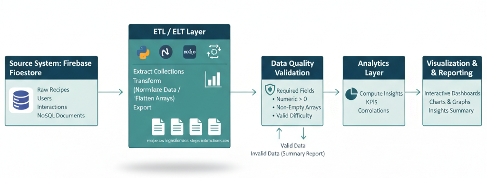
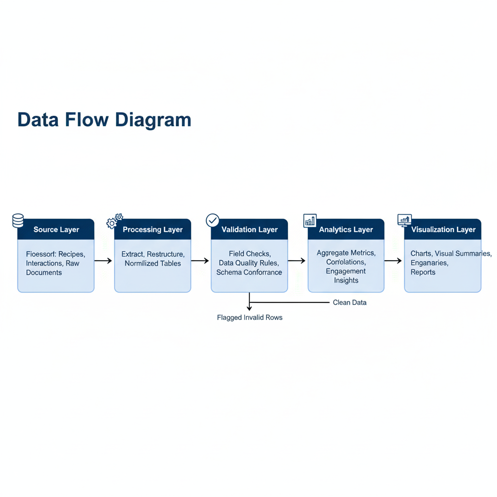
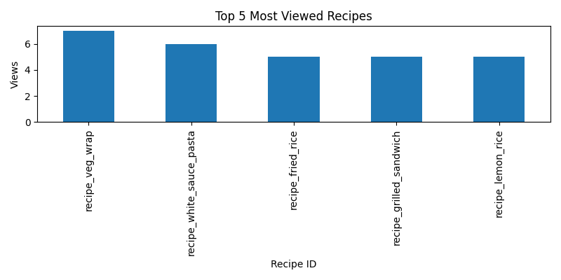
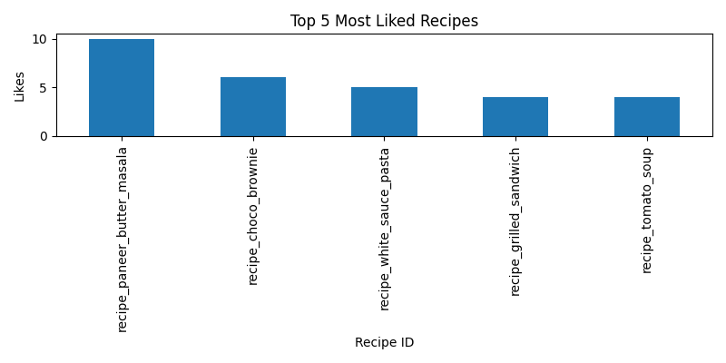
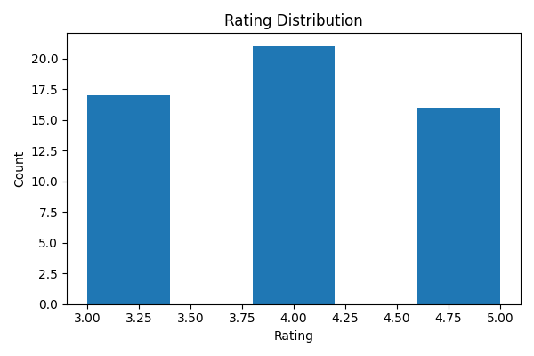
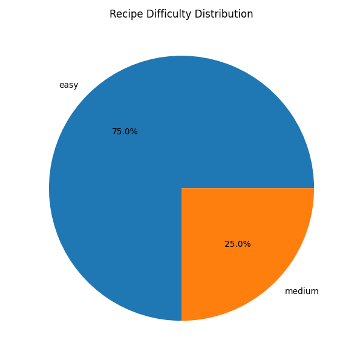
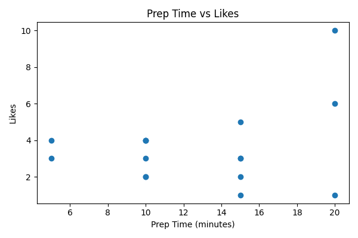
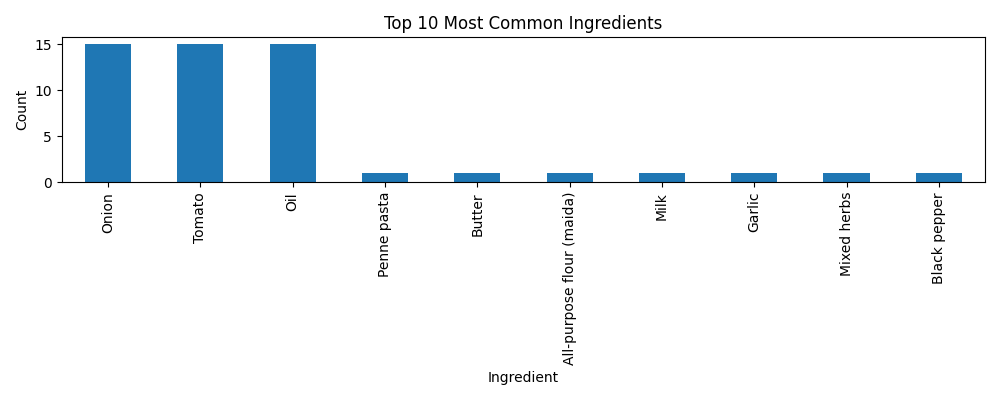
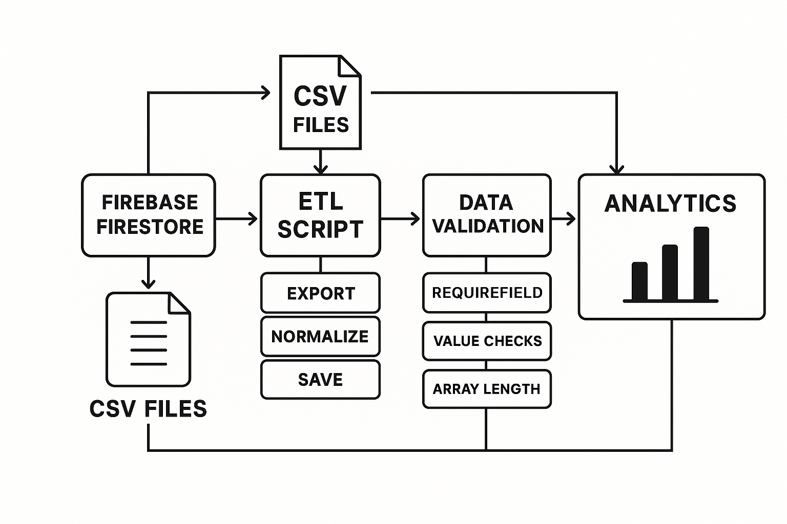

# 🍳 Recipe Analytics Pipeline with Firebase


*Figure 1: End-to-end data pipeline architecture*

[](https://www.python.org/downloads/)
[](https://opensource.org/licenses/MIT)

A comprehensive data engineering solution that demonstrates end-to-end data processing with Firebase Firestore. This project showcases:

- 🔍 **Data Modeling**: Well-structured NoSQL schema design
- 🔄 **ETL Pipeline**: Efficient data extraction, transformation, and loading
- 📊 **Analytics**: Actionable insights from recipe interactions
- ✅ **Data Quality**: Comprehensive validation framework
- 📈 **Visualization**: Clear, informative data visualizations

Built with a real-world use case using a White Sauce Pasta recipe as the primary dataset, enriched with synthetic data for comprehensive analysis.

## 🔄 Data Flow


*Figure 2: Data flow between components*

## 🗂 Project Structure

```
📦 project-root
├── 📂 data/                    # Output directory for CSV files
│   ├── recipe.csv             # Recipe master data
│   ├── ingredients.csv        # Normalized ingredients
│   ├── steps.csv              # Cooking steps
│   └── interactions.csv       # User engagement data
├── 📂 docs/
│   └── data_model.md          # Detailed schema documentation
├── 📜 analytics.py            # Data analysis and visualization
├── 📜 etl_export_to_csv.py    # Firestore to CSV exporter
├── 📜 seed_firestore.py       # Data generation and seeding
├── 📜 validate_csv_data.py    # Data quality validation
└── 📜 README.md               # This file
```

## 2. Data Model

The source system uses three Firestore collections:

### users
Stores user profiles.
Key fields:
- `userId`
- `displayName`
- `email`
- `createdAt`
- `skillLevel`
- `dietPreferences`

### recipes
Stores recipes, including ingredients and steps.
Key fields:
- `recipeId`
- `title`
- `description`
- `authorId`
- `difficulty`
- `prepTimeMinutes`
- `cookTimeMinutes`
- `totalTimeMinutes`
- `servings`
- `ingredients[]`
- `steps[]`
- `tags[]`
- `createdAt`
- `updatedAt`

### interactions
Captures user activity on recipes.
Key fields:
- `interactionId`
- `userId`
- `recipeId`
- `type` (view / like / cook_attempt / rating)
- `rating`
- `difficultyRating`
- `successStatus`
- `comment`
- `createdAt`

## 🚀 Getting Started

### Prerequisites
- Python 3.11 or higher
- Firebase account with Firestore enabled
- Basic Python and command line knowledge

### Step 1: Environment Setup

1. **Clone the repository**
   ```bash
   git clone <repository-url>
   cd <project-directory>
   ```

2. **Create and activate virtual environment**
   ```bash
   # Windows
   python -m venv .venv
   .\.venv\Scripts\activate
   
   # macOS/Linux
   python3 -m venv .venv
   source .venv/bin/activate
   ```

3. **Install dependencies**
   ```bash
   pip install -r requirements.txt  # Create this file with the dependencies below
   ```
   
   Or install individually:
   ```bash
   pip install firebase_admin==7.1.0 pandas==2.3.3 matplotlib==3.10.7
   ```

### Step 2: Firebase Configuration

1. **Create a Firebase Project**
   - Go to [Firebase Console](https://console.firebase.google.com/)
   - Click "Add project" and follow the setup wizard
   
2. **Set up Firestore Database**
   - In the Firebase Console, navigate to "Firestore Database"
   - Click "Create database" and start in production mode
   - Choose a location close to your users
   
3. **Generate Service Account Key**
   - Go to Project Settings > Service Accounts
   - Click "Generate new private key"
   - Save the JSON file as `serviceAccountKey.json` in your project root
   - ⚠️ **Important**: Add `serviceAccountKey.json` to your `.gitignore` file

## 🏃‍♂️ Running the Pipeline

### Step 1: Seed Firestore with Sample Data

```bash
python seed_firestore.py
```

**What this does:**
- Creates 5 sample user profiles
- Adds 16 diverse recipes (including White Sauce Pasta)
- Generates 200+ realistic user interactions
- Outputs success message with record counts

### Step 2: Export Data to Structured CSVs

```bash
python etl_export_to_csv.py
```

**Output files in `data/` directory:**
- `recipe.csv` - Core recipe information
- `ingredients.csv` - Normalized ingredients list
- `steps.csv` - Step-by-step cooking instructions
- `interactions.csv` - User engagement metrics

### Step 3: Validate Data Quality

```bash
python validate_csv_data.py
```

**Validation includes:**
- Required field checks
- Data type validation
- Referential integrity
- Business rule enforcement
- Generates: `validation_report.json`

### Step 4: Generate Analytics & Visualizations

```bash
python analytics.py
```

**Outputs:**
- Terminal display of key metrics
- Visualizations saved as PNG files:
  - `views_top5.png` - Recipe popularity
  - `difficulty_distribution.png` - Recipe difficulty spread

## 📊 Analytics Dashboard

### Key Performance Indicators

| Metric | Value |
|--------|-------|
| Total Recipes | 16 |
| Total Users | 5 |
| Total Interactions | 200+ |
| Average Rating | 4.2/5 |
| Most Popular Recipe | Paneer Butter Masala |
| Average Prep Time | 13 minutes |

### Insights Generated

#### Recipe Performance
- 🏆 **Top 5 Most Viewed Recipes**
- ❤️ **Most Liked Recipes**
- ⭐ **Average Rating per Recipe**
- ⏱️ **Average Preparation Time**
- 🏅 **View-to-Like Conversion Rate**

#### Ingredient Analysis
- 🥕 **Most Common Ingredients**
- 🧂 **Average Ingredients per Recipe**

#### User Engagement
- 📈 **Interaction Trends**
- 🎯 **Recipe Difficulty Distribution**
- ⏳ **Cooking Time Analysis**

## 📋 Sample Output

### Terminal Output
```markdown
=== RECIPE ANALYTICS REPORT ===

📊 Top 5 Most Viewed Recipes:
1. Veg Wrap - 7 views
2. White Sauce Pasta - 6 views
3. Fried Rice - 5 views
4. Grilled Sandwich - 5 views
5. Lemon Rice - 5 views

❤️ Top 5 Most Liked Recipes:
1. Paneer Butter Masala - 10 likes
2. Chocolate Brownie - 6 likes
3. White Sauce Pasta - 5 likes
4. Grilled Sandwich - 4 likes
5. Tomato Soup - 4 likes

⭐ Average Ratings:
- Grilled Sandwich: 5.0/5
- Fried Rice: 4.67/5
- Chocolate Brownie: 4.5/5
- Veg Pulao: 4.33/5
- Veg Maggi: 4.25/5

📈 Difficulty Distribution:
- Easy: 12 recipes (75%)
- Medium: 4 recipes (25%)
- Hard: 0 recipes (0%)

⏱️ Average Prep Time: 13 minutes
🥕 Most Common Ingredient: Onion (used in 15 recipes)
```

### Generated Visualizations

#### Recipe Popularity

*Figure 1: Bar chart showing the top 5 most viewed recipes.*

#### Recipe Engagement

*Figure 2: Bar chart showing the top 5 most liked recipes.*

#### Rating Analysis

*Figure 3: Distribution of recipe ratings across all interactions.*

#### Recipe Difficulty

*Figure 4: Distribution of recipes by difficulty level.*

#### Preparation Time vs. Popularity

*Figure 5: Scatter plot showing the relationship between preparation time and number of likes.*

#### Ingredient Analysis

*Figure 6: Bar chart showing the 10 most frequently used ingredients across all recipes.*

#### User Interactions

*Figure 7: Distribution of different types of user interactions (views, likes, ratings, etc.).*

## 🔄 Process Flow


*Figure 8: Detailed process flow of the analytics pipeline*

## 🛠️ Dependencies

### Core Dependencies
| Package | Version | Purpose |
|---------|---------|---------|
| Python | 3.11+ | Programming Language |
| firebase_admin | 7.1.0 | Firebase SDK for Python |
| pandas | 2.3.3 | Data manipulation |
| matplotlib | 3.10.7 | Data visualization |

### Development Dependencies
- black (code formatting)
- flake8 (linting)
- pytest (testing)

Create a `requirements.txt` file with:
```
firebase_admin==7.1.0
pandas==2.3.3
matplotlib==3.10.7
```

## 🚀 Future Enhancements

### High Priority
- [ ] **Recipe Images** - Add support for recipe photos
- [ ] **User Authentication** - Secure API endpoints
- [ ] **Web Dashboard** - Interactive data visualization

### Medium Priority
- [ ] **Automated Testing** - Unit and integration tests
- [ ] **Data Versioning** - Track changes over time
- [ ] **API Endpoints** - RESTful API for data access

### Nice-to-Have
- [ ] **Recipe Recommendations** - ML-based suggestions
- [ ] **Meal Planning** - Weekly menu generator
- [ ] **Shopping List** - Auto-generated from recipes
- [ ] **Dietary Filters** - Filter by dietary restrictions

## 📄 License

Distributed under the MIT License. See [LICENSE](LICENSE) for more information.

## 🤝 Contributing

Contributions are what make the open source community such an amazing place to learn, inspire, and create. Any contributions you make are **greatly appreciated**.

1. Fork the Project
2. Create your Feature Branch (`git checkout -b feature/AmazingFeature`)
3. Commit your Changes (`git commit -m 'Add some AmazingFeature'`)
4. Push to the Branch (`git push origin feature/AmazingFeature`)
5. Open a Pull Request

## 📧 Contact

Your Name - [@your_twitter](https://twitter.com/your_username) - your.email@example.com

Project Link: [https://github.com/yourusername/recipe-analytics](https://github.com/yourusername/recipe-analytics)
